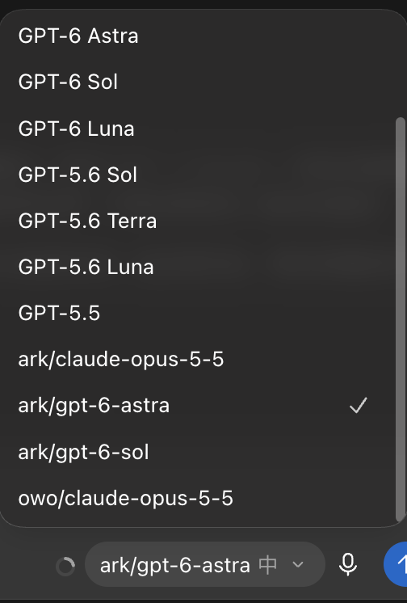

# codex-model-router — Multi-model routing for Codex Desktop

[简体中文](README.md) · [繁體中文](README.zh-TW.md) · [English](README.en.md) · [Releases](https://github.com/funkeyyou/codex-model-router/releases) · [Report an issue](https://github.com/funkeyyou/codex-model-router/issues)

**Use Claude and OpenAI-compatible models in Codex Desktop alongside official GPT models.**

A local LLM proxy and multi-provider model router for Codex Desktop / ChatGPT Desktop on macOS and Windows. Connect custom Base URLs and third-party APIs using OpenAI Responses API, Anthropic Messages API or OpenAI-compatible Chat Completions. Experimental Claude Code CLI subscription routing is also available.

## Claude Code subscription routing (experimental)

Experimental [Claude CLI subscription routing](docs/claude-cli-experimental.md) is available through menu item 6 or the `claude-cli` command. It asks before installing or updating Claude Code and guides subscription sign-in when needed.

Since v1.26.1, the installer reads the CLI's current model list first and shows numbered entries with full model IDs. Enter `1`, `1,3`, `1-3`, or `all`; you can also enter an explicit model ID or `cancel`. Numbers follow the current list order. Aliases resolving to the same version are deduplicated, and previously configured models remain listed.

Listing models sends no inference request. Only selected models are tested, using subscription quota. If discovery fails, the installer clearly labels its built-in fallback candidates. The CLI list may differ from Claude Desktop and does not guarantee available quota for every model; unlisted versions can still be tested by explicit ID.

Short text and tool roundtrips passed with a live subscription on macOS; Chrome, image generation, long conversations and Windows subscription execution still need validation. Context limits are manual settings, not verified capacities: a 1M setting with the retained 95% usable ratio appears as about 950K in Codex.

A local model router for macOS and Windows. Add your own API providers to the Codex model picker, keep their API keys separate, and switch models without repeatedly changing the global provider configuration.



*An actual model picker example. Prefixes and available models depend on your providers and account; these models are not bundled with the installer.*

## What it does

- Keeps official ChatGPT model requests going to OpenAI; selected custom models use your configured API endpoint.
- Supports OpenAI Responses API endpoints, translates Claude Messages, and probes Chat Completions as a fallback for compatible models.
- Manages multiple providers, API keys, model discovery, model removal, and provider-scoped routing IDs.
- Provides interactive macOS and Windows installers, backups during updates, and rollback.
- Optionally installs a separate relay image-generation skill using your provider's supported image models.

Chat Completions support can be useful for compatible DeepSeek, Qwen, GLM, Kimi, Gemini, Ollama, or vLLM endpoints. Availability and tool support depend on the endpoint and the model; installation probes capabilities rather than assuming support.

## Requirements and limits

You need Codex Desktop / ChatGPT Desktop, a Codex login using a ChatGPT account, and your provider's Base URL and API key. The installer requires Node.js 22.15 or newer and can use the desktop app's bundled Node.js when available.

Provider API usage is billed by the provider. This tool does not supply credits, a Claude subscription, or access to account-restricted native tools. It is an unofficial community project, not affiliated with OpenAI or Anthropic.

Tool and attachment support varies. Claude and Chat Completions translation cannot execute OpenAI-hosted tools such as native web search or native image generation. The optional relay image skill is a separate capability. See the [full compatibility reference in Chinese](README.md).

## Install

### macOS

Run in Terminal:

```bash
curl -fsSL https://github.com/funkeyyou/codex-model-router/raw/refs/heads/main/codex-model-router.sh -o codex-model-router.sh && bash codex-model-router.sh
```

### Windows

Run in PowerShell:

```powershell
curl.exe -fsSL https://github.com/funkeyyou/codex-model-router/raw/refs/heads/main/codex-model-router.ps1 -o codex-model-router.ps1; powershell -ExecutionPolicy Bypass -File .\codex-model-router.ps1
```

The installer prompts for your Base URL, API key, and models. API key input is hidden. Model capability probes make API requests and may incur charges. Installer prompts are currently in Traditional Chinese; the commands below provide direct entry points.

For a pinned version, download the installers and `SHA256SUMS` from [Releases](https://github.com/funkeyyou/codex-model-router/releases).

## Manage models and providers

Run these commands from the directory containing the downloaded installer:

```bash
bash codex-model-router.sh add                # Add custom models
bash codex-model-router.sh remove             # Remove custom models
bash codex-model-router.sh providers add      # Add an API provider
bash codex-model-router.sh providers key      # Change a provider's API key
bash codex-model-router.sh providers remove   # Remove a provider and its models
bash codex-model-router.sh imagegen           # Configure relay image generation
bash codex-model-router.sh status             # Check installation and service status
```

On Windows, replace `bash codex-model-router.sh` with `powershell -ExecutionPolicy Bypass -File .\codex-model-router.ps1`.

Models that already have a prefix, such as `ark/model-name`, keep that name when newly added. Provider-specific internal IDs keep different providers' credentials separate even if their model display names match.

## Update and rollback

Download the latest installer using the command above, then select the update option, or run:

```bash
bash codex-model-router.sh update
```

Updates preserve configured providers and models and back up managed files. A failed update attempts to restore the prior installation and restart the service.

To remove the router configuration:

```bash
bash codex-model-router.sh rollback
```

**Before rollback:** conversations containing translated Claude history may no longer work with the official backend once the router is removed. Start a new conversation after rollback, or keep the router for those existing conversations. Read the [rollback details](README.zh-TW.md#回退之後用過-claude-模型的舊對話會壞掉) first.

## Development and help

Source files live in `src/`; the single-file installers are generated with `node tools/build.mjs`. Run `npm ci` and `npm run check` for build consistency, lint, and tests.

For troubleshooting, advanced settings, and architecture, see the [full Chinese reference](README.md). When [reporting an issue](https://github.com/funkeyyou/codex-model-router/issues), include your OS, desktop/CLI version, router version, and redacted error output. Do not include API keys or login tokens.
